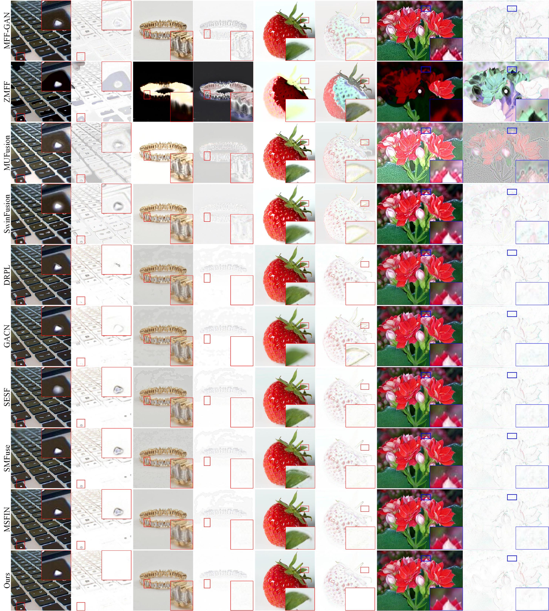

#  Generation and Reconmbination for Multifocus Image Fusion with Free Number of Inputs
- [paper](https://arxiv.org/abs/2309.04657)

---
## Pipeline

---

## Recommended Environment
We strongly recommend that you use Conda as a package manager.

```shell
# create virtual environment
conda create -n GRFusion python=3.10
conda activate GRFusion
# select pytorch version yourself
# install SegMiF requirements
pip install -r requirements.txt
```

## Prepare Datasets
Download the Lytro dataset from [here](https://mansournejati.ece.iut.ac.ir/content/lytro-multi-focus-dataset), MFI-WHU dataset from [here](https://github.com/HaoZhang1018/MFI-WHU) and MFFW dataset form [here](https://www.semanticscholar.org/paper/MFFW%3A-A-new-dataset-for-multi-focus-image-fusion-Xu-Wei/4c0658f338849284ee4251a69b3c323908e62b45)

Organize them in `your dataset root dir` folder as follows:
```
|-- your dataset root dir/
|   |-- <Train>/
|       |-- 001.png
|       |-- 002.png
|       |-- 003.png
|
|   |-- <Test>/
|       |-- Lytro
|            |-- lytro-01-A.jpg
|            |-- lytro-01-B.jpg
|            |-- Triple Series
|                |-- lytro-01-A.jpg
|                |-- lytro-01-B.jpg
|                |-- lytro-01-C.jpg
|       |-- MFI-WHU
|            |-- MFI-WHU_01_A.jpg
|            |-- MFI-WHU_01_B.jpg
|       |-- MFFW
|            |-- MFFW2
|                |-- MFFW2_01_A.jpg
|                |-- MFFW2_01_B.jpg
|            |-- MFFW3
|                |-- MFFW3_01_A.jpg
|                |-- MFFW3_01_B.jpg
|                |-- MFFW3_01_C.jpg
```

## To Train
The training code for both the focus detection and fusion parts is provided here.

If you want to train the focus detection network : Run "**CUDA_VISIBLE_DEVICES=0 python train_fd.py**".

If you want to train the fusion network : Run "**CUDA_VISIBLE_DEVICES=0 python train_fusion.py**".


## To Test
The test code for both the focus detection and fusion parts is also provided here.

If you want to test the focus detection network : Run "**CUDA_VISIBLE_DEVICES=0 python test_fd.py**".

If you want to test the fusion network : Run "**CUDA_VISIBLE_DEVICES=0 python test_fusion.py**".


## Our results


## Contact

If you have any questions, please feel free to contact me. (wd97@stu.kust.edu.cn).


